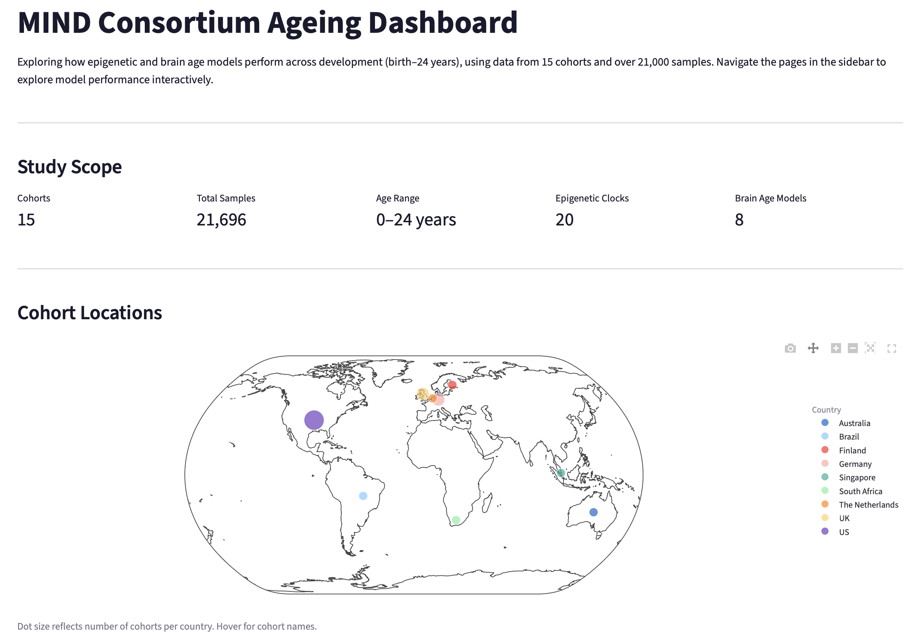
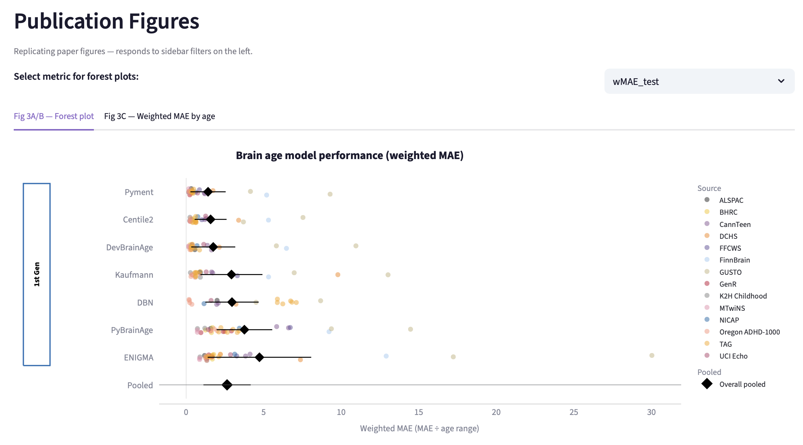
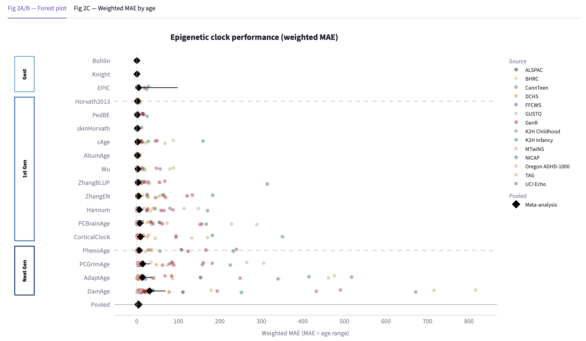
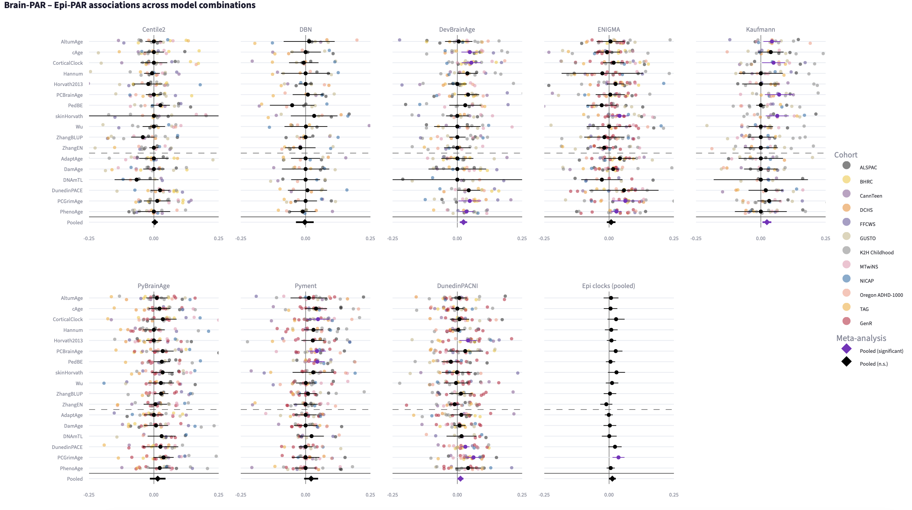
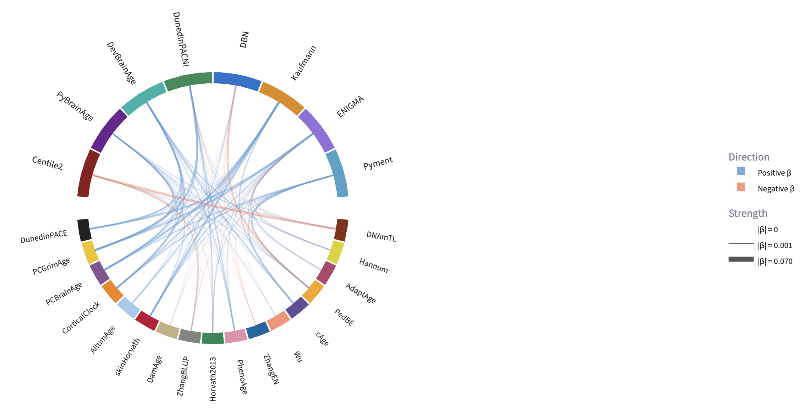
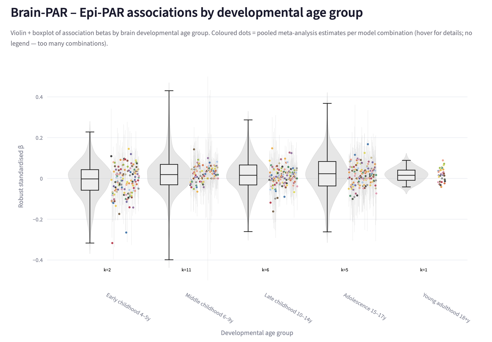

# MIND Consortium Ageing Dashboard

Interactive dashboard accompanying the paper:

> **Associations between epigenetic and brain age across development: Findings from the MIND consortium**
> Staginnus, Baltramonaityte, Schuurmans et al. (2026, in preparation)

[](https://epi-brain-age-dashboard.streamlit.app/)

---

## Overview

This dashboard allows interactive exploration of epigenetic and brain age model performance and their associations across development (birth–24 years), based on data from 15 cohorts and over 21,000 samples from the MIND Consortium.

**Pages:**

- **Home** — study scope, cohort map, and model descriptions
- **Brain Age** — performance metrics (MAE, R², Pearson r) and publication figures for 8 brain age models
- **Epigenetic Age** — performance metrics and publication figures for 20 epigenetic clocks
- **Associations** — Brain-PAR × Epi-PAR associations across model combinations, age groups, and a chord diagram of association structure

All figures respond to sidebar filters (cohort, model, age group).

---

## Screenshots

### Home


### Brain Age


### Epigenetic Age


### Associations — Fig 4A


### Associations — Fig 4B (chord diagram)


### Associations — Fig 4C


---

## Run locally

```bash
# Clone the repository
git clone https://github.com/VilteBaltra/epi-brain-dashboard.git
cd epi-brain-dashboard

# Install dependencies
pip install -r requirements.txt

# Launch the dashboard
streamlit run Home.py
```

Requires Python 3.9+.

---

## Repository structure

```
├── Home.py                      # Landing page
├── pages/
│   ├── 1_Brain_Age.py
│   ├── 2_Epigenetic_Age.py
│   └── 3_Associations.py
├── data/                        # Summary statistics (no individual-level data)
├── plot_helpers.py              # Shared plotting functions
├── requirements.txt
├── CITATION.cff
└── LICENSE
```

---

## Citation

If you use this dashboard or the underlying findings, please cite:

> Staginnus M, Baltramonaityte V, Schuurmans I, et al. (2026). *Associations between epigenetic and brain age across development: Findings from the MIND consortium.* In preparation.

If you reuse the dashboard code, we would also appreciate a reference to the GitHub repository:
[https://github.com/VilteBaltra/epi-brain-dashboard](https://github.com/VilteBaltra/epi-brain-dashboard)

A `CITATION.cff` file is included for one-click citation export via GitHub.

---

## License

MIT © 2026 The MIND Consortium
